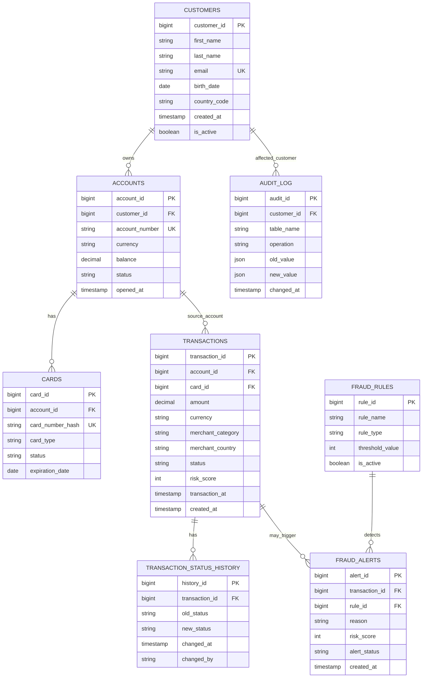

# Advanced PostgreSQL Assignment
# Banking Fraud Monitoring System

## Overview

In this assignment, students will design and implement an advanced PostgreSQL database solution for a banking fraud monitoring system.

The goal is to practice advanced database concepts beyond basic CRUD operations by implementing:

- Tables
- Constraints
- Triggers
- Functions
- Stored Procedures
- Views
- Materialized Views
- Scheduled Refresh Jobs (bonus)

The system should simulate a production-like fraud detection environment used in modern banking systems.
---

# Business Scenario

A bank wants to build an internal Fraud Monitoring System that:

- stores customers, accounts, cards, and transactions;
- automatically detects suspicious transactions;
- tracks status changes of transactions;
- maintains audit logs;
- provides analytical reporting using views and materialized views;
- refreshes fraud dashboards automatically.

The solution must be implemented in PostgreSQL.

---

# Main Database Objects

Students must implement the following database objects.

---

# 1. Tables

Create the following tables:

- `customers`
- `accounts`
- `cards`
- `transactions`
- `transaction_status_history`
- `fraud_rules`
- `fraud_alerts`
- `audit_log`

Students may add additional tables if needed.

---

# 2. Constraints

Implement appropriate constraints.

Examples include:

## Primary Keys

Each table must have a primary key.

## Foreign Keys

Relationships must be enforced between related entities.

## Unique Constraints

Examples:

- customer email
- account number
- hashed card number

## Check Constraints

Examples:

```sql
amount > 0
````

```sql
balance >= 0
```

```sql
currency IN ('UAH', 'USD', 'EUR')
```

```sql
status IN ('PENDING', 'APPROVED', 'DECLINED', 'FLAGGED')
```

---

# 3. Functions

Implement reusable PostgreSQL functions.

Examples:

## Example Functions

### Calculate customer daily transaction volume

```sql
calculate_customer_daily_volume(customer_id, target_date)
```

### Check whether country is high-risk

```sql
is_high_risk_country(country_code)
```

### Calculate transaction risk score

```sql
calculate_transaction_risk_score(transaction_id)
```

### Mask card number

```sql
mask_card_number(card_number)
```

### Get customer age

```sql
get_customer_age(customer_id)
```

Students are encouraged to create additional helper functions.

---

# 4. Stored Procedures

Implement stored procedures for business logic.

Examples:

## Example Procedures

### Process transaction

```sql
process_transaction(transaction_id)
```

### Create fraud alert

```sql
create_fraud_alert(transaction_id, reason, risk_score)
```

### Freeze account

```sql
freeze_account(account_id)
```

### Approve pending transactions

```sql
approve_pending_transactions()
```

### Refresh fraud dashboard

```sql
refresh_fraud_dashboard()
```

---

# 5. Triggers

Implement triggers to automate business processes.

Examples:

## Required Trigger Logic

### Transaction Risk Evaluation

After inserting a transaction:

* automatically calculate risk score;
* determine whether transaction should be flagged.

### Fraud Alert Creation

If risk score exceeds threshold:

* automatically create fraud alert.

### Balance Updates

When transaction status becomes `APPROVED`:

* update account balance automatically.

### Transaction Status History

Track every transaction status change in:

```sql
transaction_status_history
```

### Audit Logging

Log INSERT/UPDATE/DELETE operations into:

```sql
audit_log
```

### Customer Deletion Protection

Prevent deleting customers that still have active accounts.

---

# 6. Views

Create analytical and operational views.

Examples:

* `vw_customer_accounts`
* `vw_recent_transactions`
* `vw_flagged_transactions`
* `vw_customer_risk_profile`

Views should simplify reporting and business analysis.

---

# 7. Materialized Views

Create at least one materialized view.

## Required Materialized View

### `mv_daily_fraud_summary`

The materialized view should contain:

* transaction date;
* total transactions;
* total transaction amount;
* number of flagged transactions;
* suspicious transaction amount;
* average risk score;
* top risky customers;
* total fraud alerts.

Students may create additional materialized views.

---

# 8. Scheduled Refresh (Bonus Task)

For additional points, students may implement automatic refresh of the materialized view.

Example:

```sql
REFRESH MATERIALIZED VIEW mv_daily_fraud_summary;
```

Possible PostgreSQL solutions:

* `pg_cron`
* PostgreSQL background jobs
* external scheduler (Airflow, cron, etc.)

---

# ER Diagram



---

# Technical Requirements

## PostgreSQL Features

Students should use PostgreSQL-specific functionality where appropriate, including:

* PL/pgSQL
* Trigger Functions
* Materialized Views
* Transactions
* Exception Handling
* Indexes
* Window Functions
* CTEs

---

# Expected Deliverables

Students must submit:

## SQL Scripts

* DDL scripts
* DML scripts
* Functions
* Procedures
* Triggers
* Views
* Materialized Views

## Sample Data

Provide enough data for testing.

## README File

The README should include:

* project overview;
* setup instructions;
* assumptions;
* explanation of fraud logic;
* refresh strategy for materialized views.

## Demo Queries

Provide sample analytical queries demonstrating the system.

---
# Evaluation Criteria

| Category | Points |
|---|---|
| Constraints & Data Integrity | 1 |
| Functions | 1 |
| Stored Procedures | 1 |
| Trigger Logic | 1 |
| Views | 1 |
| Materialized Views | 1 |
| Code Quality & Documentation | 1 |
| Code Explanation & Theoretical Understanding | 8 |
| **Total** | **15** |
| **Bonus: Scheduled Materialized View Refresh** | **+2.5** |
---

# Goal

The purpose of this assignment is to simulate a real-world banking backend system and help students practice advanced PostgreSQL database engineering concepts used in enterprise environments.

```
```
