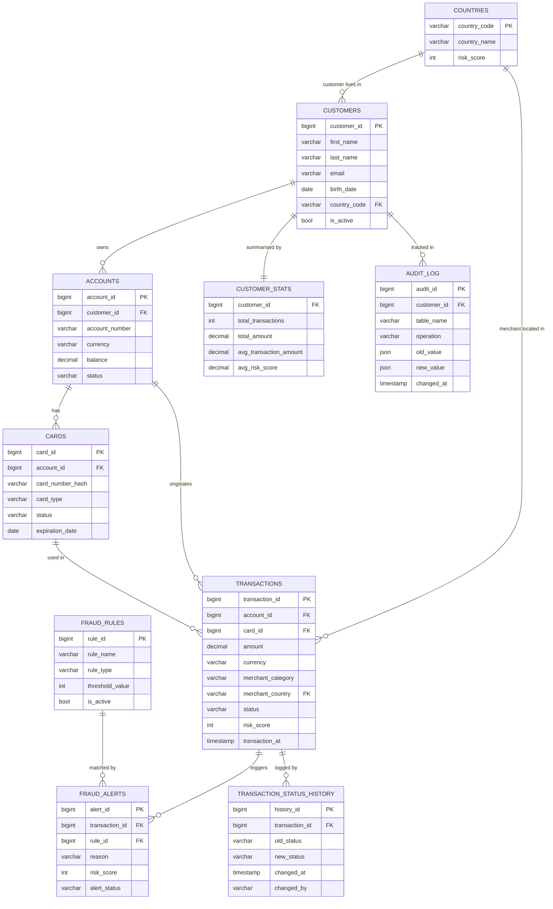

# Banking Fraud Monitoring System

A PostgreSQL-based backend system that detects and responds to fraudulent transactions in real time using rules, triggers, and automated account actions.

---

## Core Idea

Every transaction inserted into the database is automatically scored, checked against fraud rules, and either approved or flagged — with no application-layer code required. All logic lives in the database via triggers and stored procedures.

---

## ER Diagram



---

## Main Data Flow

```
INSERT transaction (status='pending', risk_score=0)
        │
        ▼
[trg_process_transaction]  ← fires automatically after every INSERT
        │
        ├─ calculate_transaction_risk_score()
        │       factors: large amount, country mismatch,
        │                currency mismatch, high-risk country, outlier amount
        │
        ├─ check each active fraud rule
        │       velocity        — > 5 tx in last hour
        │       amount_limit    — amount > 10 000
        │       geo_block       — customer country risk > 7
        │       merchant_block  — merchant country risk > 7
        │       unusual_pattern — amount > 5× customer avg
        │       high_overall_risk — risk_score > 6
        │
        ├─ violation found → pr_create_fraud_alert()
        │       • INSERT fraud_alert (status='open')
        │       • UPDATE transaction → 'flagged'
        │       • if severe → pr_freeze_account()
        │               UPDATE account → 'suspended'
        │               UPDATE cards   → 'blocked'
        │               UPDATE pending transactions → 'declined'
        │
        └─ no violations → UPDATE transaction → 'approved'
                │
                ▼
        [trg_update_balance]        balance -= amount
        [trg_transaction_status_history]  log status change
        [trg_update_customer_stat]  update aggregates
        [trg_log_audit]             write to audit_log
```

**Resolving a flagged transaction** — an analyst updates a `fraud_alert` status to `resolved` or `dismissed`. The trigger `trg_close_transaction` fires `pr_approve_flagged_transactions()`, which approves the transaction only when all alerts are resolved and none were dismissed.

---

## Key Design Decisions

| Decision | Reason |
|---|---|
| All logic in DB triggers | Zero latency; no app layer needed for fraud checks |
| `risk_score` is additive (0–10) | Each factor contributes independently; easy to tune |
| `customer_stats` denormalized table | Avoids full-scan aggregations on `transactions` at runtime |
| `geo_block` also freezes the account immediately | High-risk country is treated as a hard stop, not just a flag |
| `mv_daily_fraud_summary` materialized view | Cheap daily dashboard refresh via `pg_cron` |
| `audit_log` captures old/new JSON | Full change history without a separate CDC tool |

---

## Fraud Rules Reference

| Rule | Type | Threshold | Action |
|---|---|---|---|
| velocity | velocity | > 5 tx / hour | alert |
| amount_limit | amount_limit | > 10 000 | alert |
| geo_block | geo_block | country risk > 7 | alert + freeze |
| merchant_block | merchant_block | merchant risk > 7 | alert |
| unusual_pattern | unusual_pattern | amount > 5× avg | alert |
| high_overall_risk | high_overall_risk | risk_score > 6 | alert |

---

## Project Conversation

> Full design walkthrough and seed data generation:
> **[https://claude.ai/share/69ccb7ed-e859-4d81-aaf8-6f8c43c97c48]**
